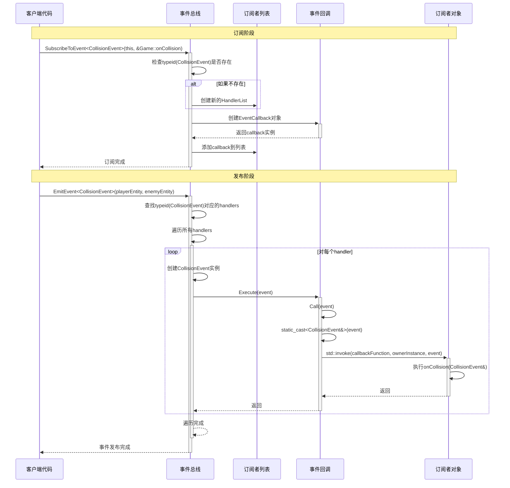

## EventSystem


方式1：passive check 发生事件了仍正常执行，直到执行到订阅到这个事件的


方式2：blocking 一旦发生事件，直接**阻塞**，去执行订阅了这个事件的回调


## 事件系统架构解析

### 1. 系统组成结构

这个事件系统采用了经典的**发布-订阅模式（Observer Pattern）**，主要由以下几个部分组成：

**基础组件：**
- `Event`：所有事件的基类
- `IEventCallback`：事件回调接口基类
- `EventCallback<TOwner, TEvent>`：具体的事件回调实现
- `EventBus`：事件总线，负责管理订阅和发布

**具体事件类：**
- `KeyPressedEvent`：键盘按键事件
- `CollisionEvent`：碰撞事件


### 2. 使用方法

**订阅事件：**
```cpp
eventBus->SubscribeToEvent<CollisionEvent>(this, &DamageSystem::onCollision);
```

**发布事件：**

```cpp
eventBus->EmitEvent<CollisionEvent>(playerEntity, enemyEntity);
```

### 4. 时序图




## 详细工作流程解析

### 订阅阶段详解

1. **调用订阅方法**

如何跟踪**subscribers**和**listeners**？

使用map<type_index, 指向该事件的函数指针数组：unique_ptr<**HandlerList**>>

即一个类型和这个类型对应的所有回调函数处理方法


`HandlerList`: typedef list<unique_ptr<EventCallback>>

`EventCallback`:对函数指针的包装，template类（如EventCallback<xxEvent>）

使用IEventCallback方便数组使用 

```cpp
eventBus->SubscribeToEvent<CollisionEvent>(this, &Game::onCollision);
```

```cpp
void OnCollision(CollisionEvent& event) {
            Entity a = event.a;
            Entity b = event.b;
           ......
}
```

```cpp
template <typename TEvent, typename TOwner>
        void SubscribeToEvent(TOwner* ownerInstance, void (TOwner::*callbackFunction)(TEvent&)) {
            if (!subscribers[typeid(TEvent)].get()) {
                subscribers[typeid(TEvent)] = std::make_unique<HandlerList>();
            }
            auto subscriber = std::make_unique<EventCallback<TOwner, TEvent>>(ownerInstance, callbackFunction);
            subscribers[typeid(TEvent)]->push_back(std::move(subscriber));
        }
```

2. **EventBus内部处理**
   - 检查`subscribers`映射表中是否存在`typeid(CollisionEvent)`对应的处理程序列表
   - 如果不存在，创建一个新的`HandlerList`
   - 创建一个`EventCallback<Game, CollisionEvent>`对象
   - 将回调对象添加到对应的处理程序列表中

Q：编译器是如何识别这两个模版参数的？

```cpp
template <typename TEvent, typename TOwner>
void SubscribeToEvent(TOwner* ownerInstance, void (TOwner::*callbackFunction)(TEvent&))
```


### 发布阶段详解

1. **调用发布方法**
```cpp
eventBus->EmitEvent<CollisionEvent>(playerEntity, enemyEntity);
```


2. **EventBus内部处理**
   - 根据`typeid(CollisionEvent)`查找对应的处理程序列表
   - 遍历列表中的所有回调函数
   - 为每个回调创建一个`CollisionEvent`实例
   - 调用回调函数的`Execute`方法

3. **EventCallback处理**
   - `Execute`方法调用虚函数`Call`
   - `Call`方法使用`std::invoke`调用实际的成员函数
   - 使用`static_cast`将基类事件转换为具体事件类型

## 关键技术点解析

### 1. 类型擦除（Type Erasure）
通过`IEventCallback`基类实现类型擦除，允许在容器中存储不同类型的回调函数。

### 2. 成员函数指针的使用
```cpp
typedef void (TOwner::*CallbackFunction)(TEvent&);
```
这种语法允许存储指向任意类的成员函数的指针。

### 3. 完美转发的优势
```cpp
TEvent event(std::forward<TArgs>(args)...);
```
避免不必要的拷贝，提高性能。

### 4. 智能指针管理
```cpp
std::list<std::unique_ptr<IEventCallback>> HandlerList;
```
自动管理内存，防止内存泄漏。

## 系统优势

1. **类型安全**：编译时检查事件类型匹配
2. **性能优良**：使用类型索引快速查找，避免字符串比较
3. **内存安全**：使用智能指针自动管理内存
4. **易于扩展**：添加新事件类型只需继承Event类
5. **完全解耦**：发布者和订阅者互不依赖

## 使用示例

```cpp
// 在Game类中订阅碰撞事件
eventBus->SubscribeToEvent<CollisionEvent>(this, &Game::onCollision);

// 在碰撞系统中发布事件
eventBus->EmitEvent<CollisionEvent>(entityA, entityB);

// Game类中的回调函数
void Game::onCollision(CollisionEvent& event) {
    // 处理碰撞逻辑
    Logger::Log("Collision detected between entities!");
}
```


在Update中给system传入eventBus


在Game的Update中:

