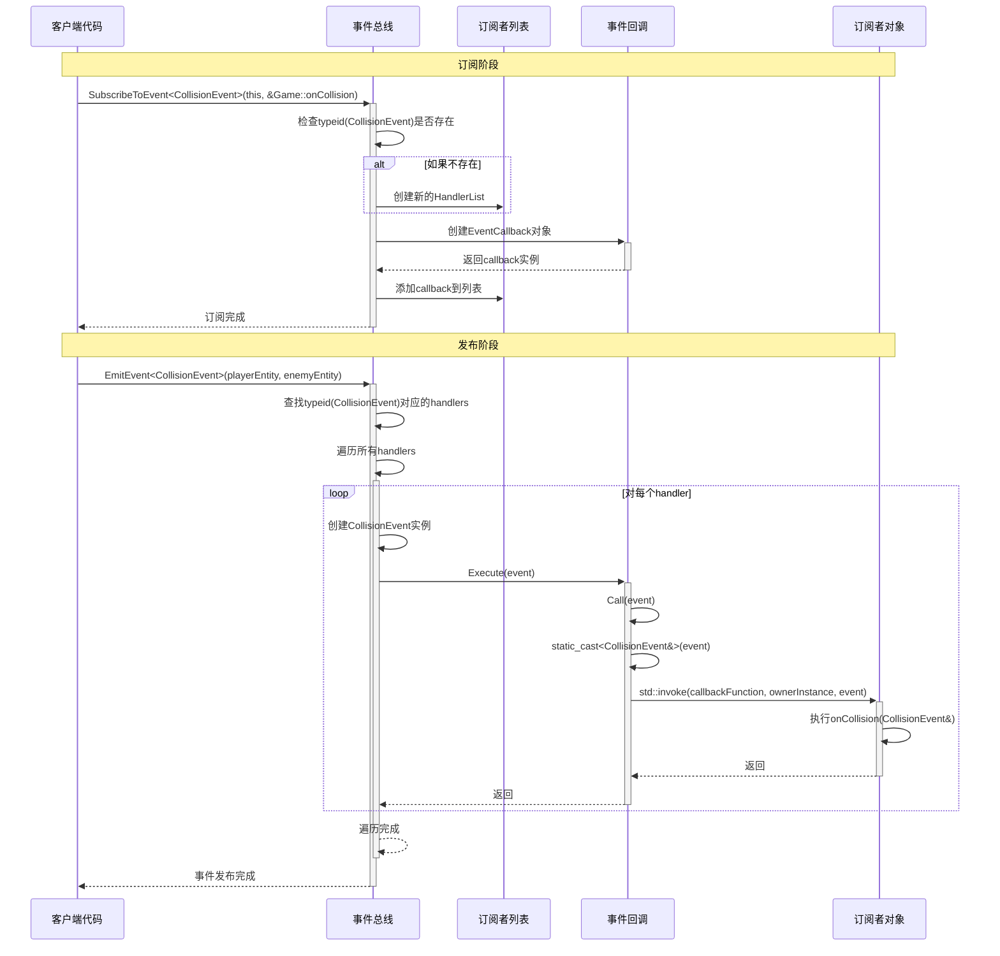

## EventSystem


方式1：passive check 发生事件了仍正常执行，直到执行到订阅到这个事件的


方式2：blocking 一旦发生事件，直接**阻塞**，去执行订阅了这个事件的回调


## 事件系统架构解析

### 1. 系统组成结构

这个事件系统采用了经典的**发布-订阅模式（Observer Pattern）**，主要由以下几个部分组成：

**基础组件：**
- `Event`：所有事件的基类
- `IEventCallback`：事件回调接口基类
- `EventCallback<TOwner, TEvent>`：具体的事件回调实现
- `EventBus`：事件总线，负责管理订阅和发布

**具体事件类：**
- `KeyPressedEvent`：键盘按键事件
- `CollisionEvent`：碰撞事件


### 2. 使用方法

**订阅事件：**
```cpp
eventBus->SubscribeToEvent<CollisionEvent>(this, &DamageSystem::onCollision);
```

**发布事件：**

```cpp
eventBus->EmitEvent<CollisionEvent>(playerEntity, enemyEntity);
```

###  

### 3.自顶向下讲解

如何跟踪**subscribers**和**listeners**？

#### 0.1使用map<type_index, unique_ptr<**HandlerList**>>

###### 即一个类型和这个类型对应的所有订阅这个类型的callback方法


#### 0.2`HandlerList`:

###### 链表，记录一组callback方法

##### typedef list<unique_ptr<.IEventCallback>>


#### 0.3`Event`类和它的子类

```cpp
class Event {
    public:
        Event() = default;
        
};

class CollisionEvent : public Event {
public:
    Entity entityA;
    Entity entityB;
    CollisionEvent(Entity entityA, Entity entityB) : entityA(entityA), entityB(entityB) {}
};
```

Event类在整个事件系统中最大的作用有两个(**重要**‼️):

1. 通过`typeid(TEvent)`来标记不同的事件类型

2. 定义了在handlerlist中callback函数接收到的属于自己事件的参数


#### 1.使用`IEventCallback`

###### 作为基类，**方便数组使用**, （因为子类是template类，会模版实例化出来很多不同的类）

由于handlerlist将其封装成指针，故必须有**虚析构**方法

同时使用**模版方法**的设计模式，核心逻辑是Call，但是对外暴露接口是Execute，故可以在实际调用前有其他逻辑处理，增加灵活性

```cpp
class IEventCallback {
public:
    virtual ~IEventCallback() = default;
    
    void Execute(Event& e) {
        Call(e);
    }
private:
    virtual void Call(Event& e) = 0;
};
```


#### 2.EventCallback实际封装回调函数的方法

实际调用时：

```cpp
subscribers[typeid(TEvent)]->push_back(std::make_unique<EventCallback<TOwner, TEvent>>(owner, callbackFunction));
```

回调函数方法构造需要的东西：

- 回调事件Event的类型（决定了这个回调函数的**事件类型**以及事件发出时**定义携带的参数**）

如CollisionEvent：

```cpp
class CollisionEvent : public Event {
public:
    Entity entityA;
    Entity entityB;
    CollisionEvent(Entity entityA, Entity entityB) : entityA(entityA), entityB(entityB) {}
};
```

- 回调函数的主人（必须有主人的对象指针才能精确的调用回调函数）

注意回调函数调用前传入的Event引用参数要从父类先通过`static_cast`转换成子类TEvent

```cpp
template<typename TOwner, typename TEvent>
class EventCallback : public IEventCallback {
typedef void (TOwner::*CallbackFunction)(TEvent&);

public:
    EventCallback(TOwner* owner, CallbackFunction callback) : owner(owner), callbackFunction(callback) {}
    virtual ~EventCallback() override = default;

private:
    TOwner* owner;
    CallbackFunction callbackFunction;

    void Call(Event& e) override {
        std::invoke(callbackFunction, owner, static_cast<TEvent&>(e)); // 注意这里是转换引用而不是对象
    }
};
```


#### 3.subscribe 和 emit 两个的主要流程讲解

##### 时序图




##### 3.1 Subscribe

实际调用时: 在`RenderBoxColliderSystem`[debug]中:

```cpp
void SubscribeToEvents(std::unique_ptr<EventBus>& eventBus) {
            eventBus->Subscribe<CollisionEvent>(this, &RenderBoxColliderSystem::OnCollision);
        }
```

Q：编译器是如何识别这两个模版参数的？

```cpp
template <typename TEvent, typename TOwner>
void Subscribe(TOwner* ownerInstance, void (TOwner::*callbackFunction)(TEvent&))
```

A: 第一个是TEvent，通过<CollisionEvent>显示指明，第二个是通过`TOwner* ownerInstance`类型推演得到

实际实现code：

```cpp
template<typename TEvent, typename TOwner>
    void Subscribe(TOwner* owner, void (TOwner::*callbackFunction)(TEvent&)) {
        if (subscribers.find(typeid(TEvent)) == subscribers.end()) {
            subscribers[typeid(TEvent)] = std::make_unique<HandlerList>();
        }

        subscribers[typeid(TEvent)]->push_back(std::make_unique<EventCallback<TOwner, TEvent>>(owner, callbackFunction));
        Logger::Log("Subscribed to event type: " + std::string(typeid(TEvent).name()));
    }
```

有TOwner模版参数，就可以

1. **明确指定成员函数所属的类**（**成员函数指针**的类型**必须包含类类型本身**，否则无法推导）
2. **将成员函数指针包装进泛型结构中**（如你的 EventCallback<TOwner, TEvent>）


##### 3.2 Emit

用法：如在`CollisionSystem` 中发布collisonEvent：

```cpp
eventBus->EmitEvent<CollisionEvent>(entity1, entity2);
```

code实现：

即从HandlerList中更具TEvent拿到`list<.IEventCallback>`

```cpp
template<typename TEvent, typename... TArgs>
    void EmitEvent(TArgs... args) {
        if (subscribers.find(typeid(TEvent)) == subscribers.end()) {
            Logger::Err("No handlers found for event type: " + std::string(typeid(TEvent).name()));
            return;
        }

        HandlerList* handlers = subscribers[typeid(TEvent)].get();
        TEvent e(args...);
        for (auto& handler : *handlers) {
            handler->Execute(e);
        }
    }
```

在实际执行Execute前，当场构建参数TEvent，用于调用所有回调函数


#### 在游戏核心逻辑Game.cpp中的注册与分发事件:

1. 在Game构造函数时：

```cpp
Game::Game() {
    Logger::Log("Game constructed");    
    isRunning = false;
    registry = std::make_unique<Registry>();
    assetStore = std::make_unique<AssetStore>();
    eventBus = std::make_unique<EventBus>();
}
```

拿到eventBus

2. 在`LoadLevel`（Update前）

```cpp
// Subscribe to events (只需要订阅一次)
    registry->GetSystem<RenderBoxColliderSystem>().SubscribeToEvents(eventBus);
    registry->GetSystem<MovementSystem>().SubscribeToEvents(eventBus);
.......
```

让各个有订阅事件需求的系统订阅事件

系统内部：如`RenderBoxColliderSystem`：

```cpp
void SubscribeToEvents(std::unique_ptr<EventBus>& eventBus) {
            eventBus->Subscribe<CollisionEvent>(this, &RenderBoxColliderSystem::OnCollision);
        }
```


3. 发出事件，如`CollisionSystem`:发出后直接阻塞，立即回调所有注册该类型的类成员函数（callback）

```cpp
if (isColliding) {
                        // Logger::LogEvent("emitting collision event for entities " + std::to_string(entity1.GetId()) + " and " + std::to_string(entity2.GetId()));
                        eventBus->EmitEvent<CollisionEvent>(entity1, entity2);
                    }
```


### 番外篇:智能指针剖析:

智能指针主要作用：避免出作用域还要手动析构的麻烦，自动析构

###### 区分关键概念：指针所有权和指针访问权

类比一个房子，房东拥有所有权，租客经过房东的授权拥有访问权，但是只有房东能够有权限出租或者售卖房子（析构资源）

总而言之，**只有拥有所有权的智能指针才负责指针背后的资源的释放**

故使用`unique_ptr`是为了避免多个智能指针指向一个对象造成一个资源析构多次的错误

它代表只有一个指针能拥有对象的所有权，但不意味着其他指针不能访问这个资源

如：

```cpp
void Update(std::unique_ptr<EventBus>& eventBus)
```

这里需要发起事件的类通过引用的方式获得Game的EventBus

```cpp
template<typename TEvent, typename... TArgs>
    void EmitEvent(TArgs... args) {
        if (subscribers.find(typeid(TEvent)) == subscribers.end()) {
            Logger::Err("No handlers found for event type: " + std::string(typeid(TEvent).name()));
            return;
        }

        HandlerList* handlers = subscribers[typeid(TEvent)].get();
        TEvent e(args...);
        for (auto& handler : *handlers) {
            handler->Execute(e);
        }
    }
```

这里eventbus的`subscribers[typeid(TEvent)]`属性是`unique_ptr<HandlerList.>`，故通过`get()`来获得资源的访问权限
